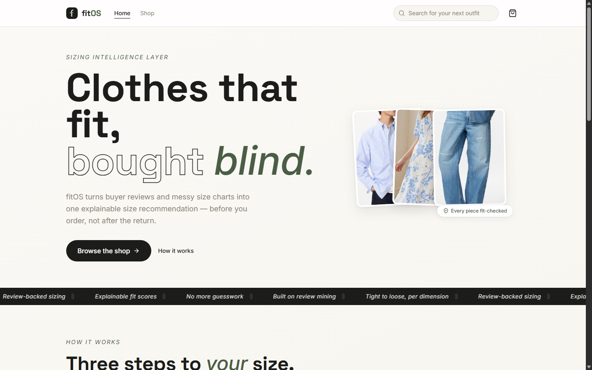
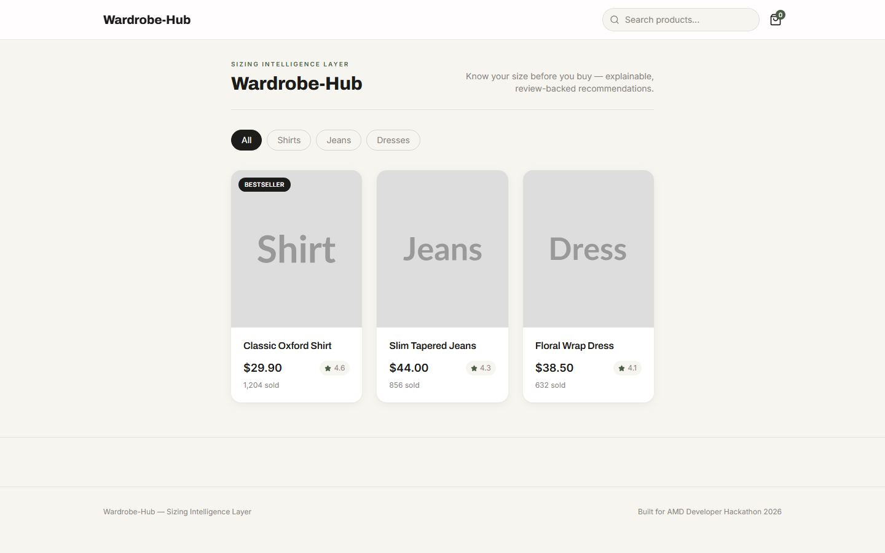
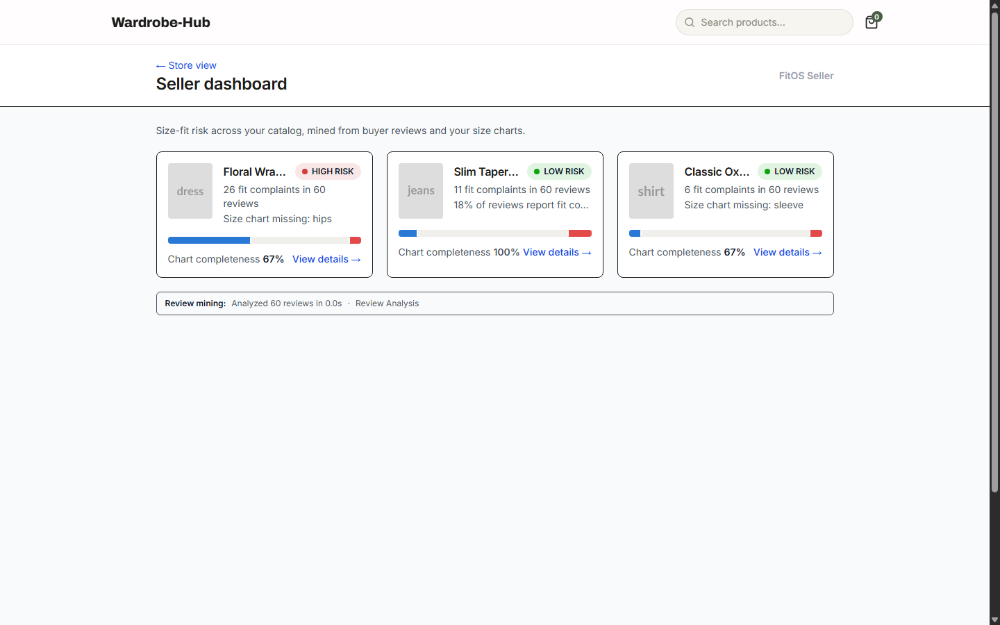
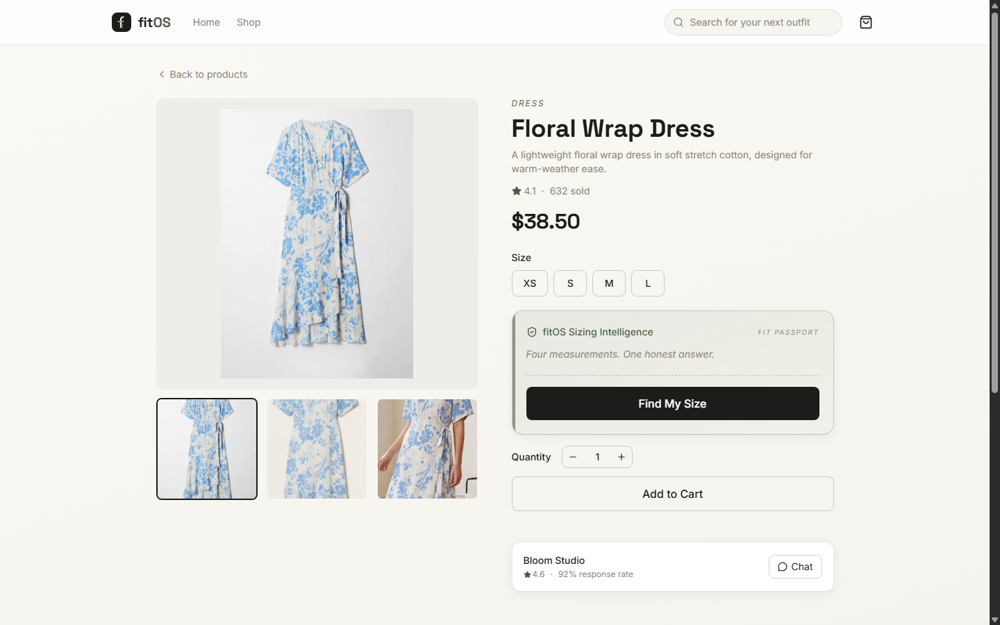
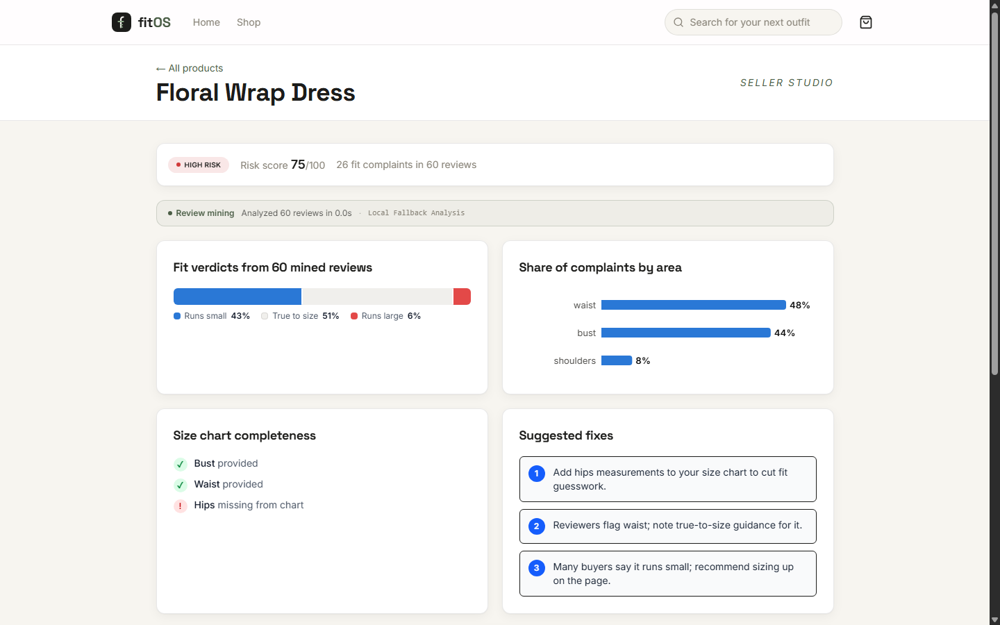

# FitOS — Wardrobe Hub

**The sizing intelligence layer for e-commerce marketplaces**: turns messy size charts and fit reviews into explainable size recommendations for buyers and fit-risk analytics for sellers.

> Built for the **AMD Developer Hackathon ACT II (Unicorn Track)** · AMD Developer Cloud · ROCm · vLLM · Gemma · Fireworks

> **Live demo:** https://fit-os-red.vercel.app · **Demo video:** [watch](https://drive.google.com/file/d/1mOQNKroImZhPgpkorIhhSkIEHnYP4H7x/view) · **Slide deck:** [PDF](https://drive.google.com/file/d/1H9xmBPIfCN_umDchfgHom3PTstB2Ixag/view)

## What's here

The **deterministic recommendation engine** (`core/`), the **FastAPI backend** (`backend/`) serving the full API over a seeded SQLite DB, and the **React frontend** (`frontend/`): storefront, fit modal, and seller dashboard, wired to the live API. The LLM never invents a size: Gemma is used only for parsing charts, mining reviews, and explaining the engine's structured output.

```
core/recommender.py    # scoring engine: ease bands, stretch rules, review bias
core/confidence.py     # confidence blend (fit 45% / margin 20% / data 20% / reviews 15%)
backend/               # FastAPI app: /api/products, /api/recommend, /api/explain, /api/seller/*, /api/cart
backend/app/ai/        # Gemma client with fallback ladder (vLLM -> Fireworks -> cache -> template)
frontend/              # React landing + storefront + fit modal + cart + seller dashboard (Vite + Tailwind)
data/seed/             # 3 demo products + 3 rehearsed personas (load-bearing: pinned by tests)
scripts/try_recommender.py         # poke the engine by hand
docs/recommendation_contract.md    # FROZEN response contract for frontend/backend
tests/                 # engine pytest suite; backend/tests/ has the API suite
docker-compose.yml     # cp .env.example .env && docker compose up -> API :8000 + storefront :5173
```

## What it looks like



| Buyer | Seller |
|---|---|
|  |  |
|  |  |

## 60-second walkthrough

1. `cp .env.example .env && docker compose up` — landing page on :5173 (**Browse the shop**), API on :8000. Works fully offline.
2. In the shop, open the **Floral Wrap Dress** → **Find My Size** → bust 90 / waist 72 → size **L** with a fit score, per-dimension fit bars, and a "runs small" caveat mined from reviews (without the review signal it would say M).
3. Open another product — the **Fit Passport** reuses your measurements: same body, different garment, different (correct) size.
4. Visit `/seller` — the dress reads **HIGH risk**: 26 fit complaints in 60 reviews, a missing hips column, complaint clusters by body area, and the mined quotes behind the numbers.
5. The **Review mining** strip reports the actual analysis provenance (AMD vLLM when configured, keyword fallback offline) — it is never hardcoded.

## Quickstart

```bash
python -m venv venv
venv\Scripts\activate            # Windows   (source venv/bin/activate on Unix)
pip install -r requirements-dev.txt
python -m pytest -q              # engine suite
python -m core.recommender       # smoke demo: prints 3 scenarios as JSON
```

### Backend API

```bash
docker compose up                # seeded, demo-ready on http://localhost:8000 (works offline)
# or without Docker:
cd backend
pip install -r requirements.txt
python -m scripts.seed && python -m scripts.ingest_analysis
uvicorn app.main:app --reload    # docs at http://localhost:8000/docs
python -m pytest -q              # backend API suite
```

Without `GEMMA_URL` / `FIREWORKS_API_KEY` in `.env`, review mining and explanations
fall back to deterministic keyword mining and template text — the demo never hangs.

### Frontend

```bash
cd frontend
npm install
npm run dev                      # http://localhost:5173, expects the API on :8000
npm run lint && npm run build    # CI runs both
```

## Try it

```bash
python scripts/try_recommender.py --list                                    # products + personas
python scripts/try_recommender.py jeans_001 --waist 81 --hips 94 --inseam 79
python scripts/try_recommender.py dress_001 --persona riley                 # review-driven M->L flip
python scripts/try_recommender.py dress_001 --persona riley --no-reviews    # ...vs. without reviews
python scripts/try_recommender.py shirt_001 --persona sam --fit regular     # fit-pref changes the size
```

Longer manual walkthrough: `python tests/manual_verify_recommender.py`

## Engine rules in one paragraph

For each size, ease = garment − body per dimension, scored against an ideal ease band for the garment type and fit preference (slim/regular/relaxed). Fabric stretch is credited at half its nominal percentage and **only ever excuses tightness, never looseness**. If ≥25% of reviews say an item runs small (and outnumber runs-large by ≥15 points), the next size up gets a +0.08 bias — the shift is capped at one size. Confidence blends fit quality, winner margin, data completeness, and reviewer agreement, clamped to 35–96; charts missing half their fields force a "low" label. Bad input raises `ValueError` only — see [docs/recommendation_contract.md](docs/recommendation_contract.md).

## Scope and known limitations

**Prototype scope:** three garment categories (tops, pants, dresses) with cm-based size charts. The 180 seeded reviews are **synthetic**, written to exercise known sizing scenarios — a runs-small cluster on the dress, a length-complaint cluster on the jeans, a clean baseline on the shirt. Fit scores and fit-risk scores are **transparent heuristics**, not statistically calibrated predictions; validating them against real purchase and return outcomes is the next development stage.

- Review percentages are shares of reviews that express a fit opinion; the counts shown beside them are actual mined-verdict counts.
- Review-driven size shifts require a 25% runs-small share and a 15-point gap over runs-large, but no minimum review count yet.
- The AMD benchmark below demonstrates functional ROCm/vLLM execution with a sequential client — it is not a tuned-throughput claim.

## Roadmap (hackathon week)

- [x] Deterministic recommendation engine + tests + seed data
- [x] FastAPI backend (`/api/recommend`, `/api/explain`, seller endpoints) + docker-compose
- [x] Gemma review mining + chart parsing on AMD Developer Cloud (vLLM/ROCm) — proof in `docs/amd_proof/`
- [x] React frontend: product page, fit modal, seller dashboard — wired to the live API
- [x] Deploy the compose stack on AMD Developer Cloud (demo video recorded there; the always-on demo now runs on CPU hosting with the same honest fallback ladder)

---

## AMD & Gemma Usage

FitOS uses AMD Developer Cloud, ROCm, vLLM, Fireworks, and Gemma for the AI parts of the system.

**The recommendation engine itself is deterministic — the LLM never invents a size.** Gemma is used only for the three language-heavy jobs it is strongest at:

1. Parsing messy seller size charts into normalized JSON.
2. Mining fit signals from product reviews (batch, on AMD GPU).
3. Generating shopper-facing explanations from the engine's structured output.

### AMD Developer Cloud + ROCm + vLLM (batch pipeline)

```txt
AMD Developer Cloud GPU instance
  -> ROCm
  -> vLLM
  -> google/gemma-2-2b-it (served as "fitos-gemma", OpenAI-compatible endpoint)
```

**Functional execution proof: 240 synthetic reviews mined in 40.0s (6.0 reviews/sec, sequential client)** against the AMD-hosted Gemma endpoint. Throughput optimization (request batching, async clients) is future work — the number demonstrates the pipeline running end-to-end on AMD hardware, not tuned MI300X performance. Evidence in [`docs/amd_proof/`](docs/amd_proof/): `rocm-smi` captures for the vLLM serve, the review-mining run, and the chart-parser run, vLLM server logs, and the raw analysis outputs. The seller dashboard surfaces the live mining stats in its "Review mining" strip. Pipeline details and reproduction steps: [docs/amd_pipeline.md](docs/amd_pipeline.md).

### Fireworks (live path) + fallback ladder

Low-latency in-demo explanation calls use the Fireworks Gemma API. Every LLM
call goes through the fallback ladder — **AMD vLLM → Fireworks → response
cache → deterministic template** — so the demo can never hang on a dead
endpoint: with no keys configured at all, the stack still answers with
keyword-mined analysis and template explanations.
